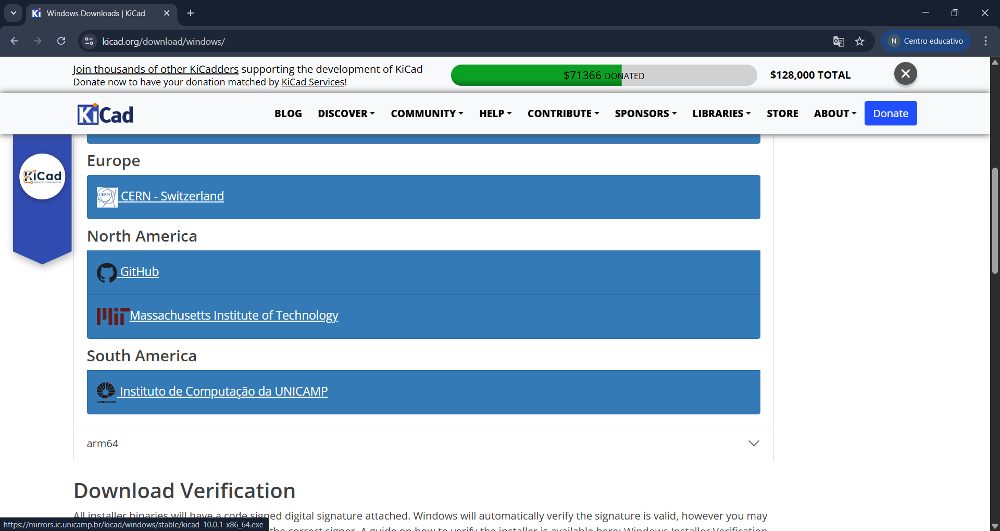
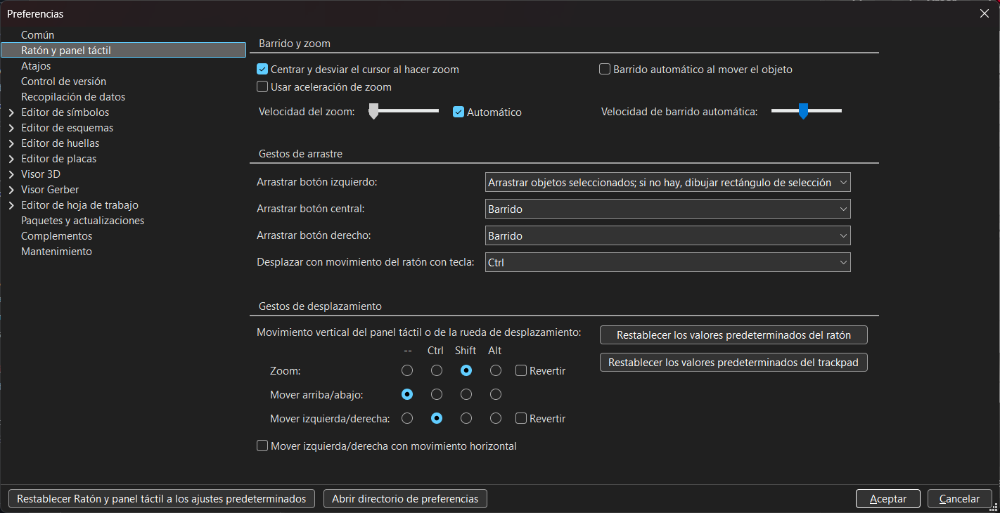

# sesion-08a

# Apuntes 28/04

## KiCad

Para ésta clase nos solicitaron traer nuestros computadores ya que nos enseñarían cómo utilizar KiCad, el cual es un software EDA (Electronic Design Automation, es decir, Automatización del Diseño Electrónico) que nos acompañará durante el resto del semestre para formar esquemáticos y poder diseñar PCB's (Printed Circuit Board, es decir, Placa de Circuito Impreso).

### Instalación de mi primer KiCad

Para iniciar, nos enseñaron cómo instalar KiCad, en lo cual tuvimos que seguir los siguientes pasos:

1. Entrar a la página web de KiCad
2. Entrar en donde nos dice "Download"

3. Seleccionar tu sistema operativo (en mi caso, Windows)
4. Seleccionar la opción de instalar en Sudamérica

Luego de que lo instalemos, tenemos que abrir el programa y KiCad nos dará la bienvenida, para luego seguir los siguientes pasos:

1. _Configuración_: Luego de presionar "siguiente", KiCad nos preguntará sobre la configuración del programa, en donde las personas que no teníamos instalado KiCad teníamos que seleccionar la opción de ``Iniciar con la configuración predeterminada``, mientras que las personas que estén actualizando KiCad a una versión más reciente tenían que seleccionar la opción ``Importar preferencias de una versión anterior en:``.
   
2. _Bibliotecas_: Como en KiCad viene dos softwares (uno para esquemáticos y otro para las pcb), tenemos que tener cuidado en dónde guardamos nuestros "símbolos" (esquemáticos) y en dónde guardamos nuestras "huellas" (pcb), por lo cual lo que **NO** tenemos que hacer es presionar la opción de ``Continuar sin bibliotecas``, sino que tenemos que presionar la opción de ``Start with the built-in KiCad libraries``.
   
3. _Actualizaciones y Privacidad_: En éste caso podemos permitir ambas opciones que se nos muestran, ya que KiCad está en constante actualización. De igual manera, depende de cada uno si desea activar las opciones o no.

## Nuestro primer KiCad

Para que aprendamos a usar Kicad, se nos indicó crear un nuevo proyecto presionando en donde dice ``default`` para luego seleccionar la opción que dice ``_sch.``, el cual es el que se encarga del esquemático, mientras que el archivo ``_pcb`` se encarga de ver, como lo menciona en su nombre, el cómo se vería la pcb del mismo esquemático.

Para empezar hicimos el esquemático del Atari Punk, el cual ya conocemos debido a que lo hicimos en nuestras protoboards en inicios de semestre.

Para poder modificar el movimiento dentro del programa, hay que entrar a ``Preferencias (Ctrl+,)`` -> ``Ratón y panel táctil`` -> ``Gestos de desplazamiento``. En ésta parte, cada uno modifica las cosas a su gusto personal.

